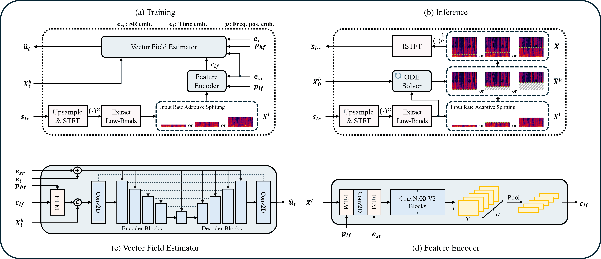

# UniverSR-mod

### A fine-tuning fork of UniverSR: Unified and Versatile Audio Super-Resolution via Vocoder-Free Flow Matching

[](https://arxiv.org/abs/2510.00771)
[](https://woongzip1.github.io/universr-demo/)
[](https://colab.research.google.com/github/woongzip1/UniverSR/blob/master/UniverSR_GUI.ipynb)

A fork of [woongzip1/UniverSR](https://github.com/woongzip1/UniverSR) (ICASSP 2026) for training and fine-tuning on your own paired audio with a single consumer GPU. The Colab badge opens the original upstream notebook.

<p align="center">
  
</p>

---

## 🎧 What is UniverSR?

UniverSR is a research model from DSPAI Lab, Yonsei University. It performs audio super-resolution directly in the complex STFT domain using flow matching, without a separate neural vocoder. The released model takes 8, 12, 16 or 24 kHz input and produces 48 kHz output across speech, music and sound effects.

## 🔧 What's Different?

This fork reworks it for fine-tuning on your own LQ/HQ pairs, with the same interface as [Emball/Apollo-mod](https://github.com/Emball/Apollo-mod). Changes relative to upstream:

**Data**
- Trains on LQ and HQ files you supply. Upstream's on-the-fly low-pass and downsample generation is removed.
- Files are resampled once to 48 kHz when chunked, with the same filter for LQ and HQ.
- Input bandwidth is a per-sample cutoff in Hz. Upstream's fixed 8/12/16/24 kHz table is replaced, so LQ files with any cutoff, or none, can be used.
- Augmentations from Apollo-mod, live or cached: stereo alternation, mid/side isolation, gain, deep gain, silence dip, polarity, pitch shift, noise and MP3 degradation.

**Model**
- Optional aligned input channels (arm C) give the network the degraded spectrum bin by bin, so it can repair bins inside the LQ band as well as extend it. Arm B keeps upstream's input. Both start from the released weights and produce the same output as the released model at step 0.
- The first generated bin is configurable.

**Training**
- fp16 on GPUs before Ampere, bf16 on Ampere and newer.
- Gradient accumulation, activation checkpointing, EMA, gradient clipping, layer freezing and a system RAM limit.
- Optimizers: AdamW, 8-bit AdamW, Gefen and GefenMuon, with per-group learning rate multipliers.
- Resume is by step. Upstream resumed by epoch.
- Ctrl+C saves a checkpoint. Creating a `PAUSED` file in the run folder suspends training.
- Validation runs on locked clips and reports ViSQOL, SI-SDR, HFNR and LSD. A baseline pass on the pretrained weights runs before step 0.
- The best checkpoint is ranked by ViSQOL, then SI-SDR, then HFNR. Upstream selects by flow-matching loss.

**Tools**
- TUI for training, inference, evaluation, config editing and utilities.
- Offline evaluation of every checkpoint on the same clips, with a zero-shot baseline row.
- Inference on stereo files and long files, with spectral-merge ensembling.
- Degrade audio and Align audio utilities.

Upstream's `train.py`, `evaluate.py` and `scripts/` are replaced by the launchers and the `core/` entry points below.

---

## ⚙️ Installation

1. Clone the repository:
```bash
git clone https://github.com/Emball/UniverSR-mod.git
cd UniverSR-mod
```

2. Download the pretrained weights into `models/`:
```bash
# requires: pip install huggingface_hub
huggingface-cli download woongzip1/universr-audio config.yaml pytorch_model.bin --local-dir ./models
```

3. Run the setup script:
```bash
# Windows
universr.bat

# Linux / macOS
chmod +x universr.sh && ./universr.sh
```

On first run this creates a `.venv`, installs PyTorch 2.7.1 (CUDA 12.6 build) and the remaining dependencies. Later runs open the TUI. Both scripts run `git pull --ff-only` on start.

| Model | Domain | HuggingFace |
|---|---|---|
| `universr-audio` | General audio | [`woongzip1/universr-audio`](https://huggingface.co/woongzip1/universr-audio) |
| `universr-speech` | Speech only | [`woongzip1/universr-speech`](https://huggingface.co/woongzip1/universr-speech) |

To use a different set of weights for a run, set `weights_path` in the config or pass `--weights_path`.

---

## 📁 Prepare Your Data

Place your audio under `data/<name>/`, where `<name>` matches `exp.name` in your config (for example `configs/universr_stfl2.yaml` uses `data/universr_stfl2/`).

```
data/universr_stfl2/
  train/
    LQ/    degraded audio (filenames must match HQ)
    HQ/    clean reference audio
  val/
    LQ/
    HQ/
```

WAV, MP3 and FLAC are accepted. Files without a matching partner are skipped with a warning. Sources can be at any sample rate.

On first run, files are resampled to 48 kHz and chunked into fixed-length segments under `usr/cache/chunks/`. The cache is keyed on source file contents and chunk parameters, so changing either triggers a rebuild. The cache is shared across configs that use the same dataset and parameters.

If your LQ files are delayed relative to HQ, set `datas.align_data` to the delay in samples of the LQ file. Set it to `0` to disable.

### Validation Set

Before training starts, two 10-second clips are extracted from each val song and cached. Clips come from the highest-energy regions of each track. On the first validation run, `val_songs` of those clips are locked. Every validation run scores those same clips and writes LQ, HQ and Restored WAVs to `val_audio/step_<N>/`, so scores are comparable across checkpoints. If the val set holds more clips than `val_songs`, the active window rotates every `val_rotate_every` steps.

Each validation run prints the current metrics next to the baseline from the pretrained weights:

```
  48.4%  step=200  200/413  1.54 it/s  loss=0.0892  data=5%  visqol=3.390 (base 2.352)  sisdr=11.692 (base 12.587)  hfnr=0.179 (base 0.248)  lsd=1.374 (base 1.512)
```

- **loss**: flow-matching loss on the latest batch. It varies widely from step to step.
- **data**: share of time spent waiting on the dataloader.
- **visqol**: perceptual quality score (0 to 5). Higher is better. Requires `visqol-python`; reported as `-1` if unavailable.
- **sisdr**: scale-invariant signal-to-distortion ratio in dB. Higher is better.
- **hfnr**: spectral flatness of the 8 to 22 kHz band in the restored audio divided by the same measure on HQ. Lower ranks better.
- **lsd**: log-spectral distance above `system.lsd_cutoff_hz`. Lower is better.

The metrics are the results of the most recent validation run and stay fixed between runs.

---

## 🏋️ Training

Run `universr.bat` (Windows) or `./universr.sh` (Linux / macOS) to open the TUI. Select **Train**, choose a config and training starts with live output. Ctrl+C saves a checkpoint and returns to the menu. Ctrl+I pauses training to run inference.

To run directly:

```bash
universr.bat train --conf_dir configs/universr_stfl2.yaml
```

Add `--resume` to continue the newest run, or set `resume: true` in the config. On resume, the config's `optimizer.lr` replaces the learning rate stored in the checkpoint, and the checkpoint is validated once before training continues.

Before step 0, a baseline pass runs on the pretrained weights and is cached. The cache key covers the source code and the `model`, `transform`, `system` and `datas` sections, so changing any of them re-runs the pass.

```
[baseline] sisdr=12.587  hfnr=0.248  visqol=2.352  lsd_high=1.512
```

Each run creates a timestamped folder:

```
runs/<name>/<timestamp>/
  checkpoints/     all checkpoints
  logs/            TensorBoard logs
  val_audio/       LQ, HQ and Restored WAVs per validation step
  best_model.pth   written when training ends
```

### Checkpoints

All checkpoints are kept. Each name carries the validation metrics:

```
step=000400-sisdr=11.225-visqol=3.941-hfnr=0.308.ckpt
```

The best checkpoint is the one with the highest ViSQOL, ties broken by SI-SDR, then by lower HFNR. A checkpoint saved by Ctrl+C is named `step=<N>.ckpt` and is never ranked best. `best_model.pth` holds the EMA weights of the best checkpoint and loads without a config.

### Experiment Arms

| Arm | Description | Setup |
|---|---|---|
| A | Zero-shot pretrained model | The baseline pass, or `evaluate --baseline` |
| B | Fine-tune with cutoff-aware conditioning | `model.aligned_input: false` |
| C | B plus aligned input channels | `model.aligned_input: true` |

---

## 🔊 Inference

Open the TUI and select **Inference** to pick a config, model and input file. The TUI remembers your last settings per config. Batch processing runs all files in an input folder in sequence.

```bash
universr.bat inference --in_wav input.wav --out_wav output.wav --conf_dir configs/universr_stfl2.yaml
```

Output is a 32-bit float WAV at 48 kHz. Stereo files are restored one channel at a time. Long files are processed in overlapping chunks.

| Flag | Description |
|---|---|
| `--weights` | A `.ckpt`, `best_model.pth`, a pretrained `.bin`, or `pretrained`. If omitted, the best checkpoint of the config's experiment is used. |
| `--conf_dir` | Training config for model and system settings. Not needed for `best_model.pth`. |
| `--chunk_sec`, `--overlap_sec` | Chunk and overlap length in seconds. Defaults `6.0` and `0.5`. |
| `--no_chunked` | Process each channel in one pass. Needs more VRAM. |
| `--device`, `--precision` | `auto`, `cuda`, `cpu`, `cuda:1`. Precision `auto`, `fp32`, `fp16`, `bf16`. |
| `--cutoff_hz` | LQ cutoff in Hz, or `auto`. Defaults to `datas.cutoff_hz` from the config. |
| `--steps` | ODE integration steps. Defaults to `system.val_ode_steps`. |
| `--guidance` | Classifier-free guidance scale. `0` disables it. Defaults to `system.val_guidance`. |
| `--seed` | Noise seed. Default `1234`. |
| `--shared_noise` | Use the same noise for left and right. |
| `--match_input_sr` | Resample the output to the input file's sample rate. |

Higher guidance gives denser high-frequency structure and moves further from the reference. Upstream's recommended ranges:

| Domain | `guidance` |
|---|---|
| Speech | 1.0 to 1.5 |
| Music | 1.5 to 2.0 |
| Sound effects | 1.5 |

### Spectral Merge (Ensemble Inference)

Inference can blend the original input with the restored output in the frequency domain, or blend the outputs of two checkpoints. The TUI offers presets after you pick an output path, including low-end preserve and a transition blend up to 24 kHz.

```bash
# Low-end preservation (crossover at 700 Hz)
universr.bat inference ... --low_end_preserve

# Custom crossover frequency
universr.bat inference ... --low_end_preserve --low_end_hz 1000

# Full band control via JSON
universr.bat inference ... --ensemble '[{"lo":0,"hi":700,"mode":"max_fft","weight":1.0},{"lo":15000,"hi":24000,"mode":"avg","weight":0.6}]'

# Second checkpoint
universr.bat inference ... --aux_weights runs/other/<timestamp>/checkpoints/<name>.ckpt --aux_conf_dir configs/other.yaml --aux_ensemble '[{"lo":8000,"hi":24000,"mode":"enhanced","weight":1.0}]'
```

**Blend modes per band:**
- `max_fft`: bin-wise maximum magnitude of original and restored
- `min_fft`: bin-wise minimum magnitude
- `avg`: linear average of magnitudes
- `original`: use the input only
- `enhanced`: use the model output only

Each band also has a `weight` (0 to 1) that blends between the mode result and the pure restored output.

---

## 📊 Evaluation

```bash
universr.bat evaluate --conf_dir configs/universr_stfl2.yaml --baseline
```

Every checkpoint in the experiment is scored on the same fixed set of validation clips, so the table is comparable across checkpoints. It ignores the rotating-window numbers in checkpoint names. Results are cached per checkpoint and settings. Checkpoints are ranked by a composite score weighted ViSQOL 0.60, HFNR 0.25, SI-SDR 0.15.

| Flag | Description |
|---|---|
| `--conf_dir` | Config to evaluate. |
| `--ckpt_dir` | Checkpoint folder. Defaults to the newest run. |
| `--limit` | Total validation clips across songs. Defaults to `training.eval_clips`. |
| `--visqol` | Also run ViSQOL. |
| `--baseline` | Add the zero-shot pretrained model as a row. |
| `--pattern` | Only evaluate checkpoints whose names contain this text. |
| `--device` | `auto`, `cuda`, `cpu`. |

---

## 🛠️ Utilities

Available from **Utilities** in the TUI.

- **Degrade audio** (`utils/degrade_audio.py`): applies a degradation chain defined in a JSON file under `utils/degrade/`. Steps: `wma_encode`, `mp3_lame`, `mp3_fhg`, `lowpass`, `highpass`. `mp3_fhg` needs a local `acmenc.exe` path set in the JSON. Requires ffmpeg.
  ```bash
  python utils/degrade_audio.py --config utils/degrade/default.json --input in.flac --output out_dir
  python utils/degrade_audio.py --config utils/degrade/default.json --input in_folder --output out_dir --bulk
  ```
- **Align audio** (`utils/align_audio.py`): time-aligns LQ files to their HQ counterparts.
- **Update UniverSR-mod**: pulls the latest changes and relaunches.

`tests/SMOKE.md` lists the checks to run on a new machine, and `tests/bench_gpu.py` reports step time and peak VRAM for the model variants.

---

## 📖 Config Reference

Experiment configs live in `configs/`. `configs/universr_stfl2.yaml` and `configs/universr_stfl_new.yaml` are included. `configs/universr_pretrained.yaml` is the reference config for the released weights and is not an experiment. Copy and rename a config for each run.

### exp and top level

| Key | Description |
|---|---|
| `exp.dir` | Root directory for run outputs. |
| `exp.name` | Run folder name. Also the data folder: `data/<name>/`. |
| `resume` | `true` resumes the newest run. `false` starts a new run. |
| `seed` | Random seed. |
| `weights_path` | Pretrained weights or a previous `.ckpt`. `null` uses `models/pytorch_model.bin`. |

### optimizations

| Key | Description |
|---|---|
| `tf32` | TF32 matmuls. Only affects Ampere and newer GPUs. |
| `cudnn_benchmark` | Benchmarks cuDNN algorithms on first use. |
| `triton_cache` | Caches compiled Triton kernels between runs. |
| `ram_limit_fraction` | Fraction of system RAM at which the process exits. |

### training

| Key | Description |
|---|---|
| `max_steps` | Optimizer step limit. |
| `grad_accum_steps` | Accumulate gradients over N batches. Validation and checkpoint intervals count optimizer steps. |
| `grad_clip` | Gradient norm clip. |
| `precision` | `auto` selects fp16 on GPUs before Ampere and bf16 on Ampere and newer. |
| `ema_decay` | EMA decay. Validation scores the EMA weights and `best_model.pth` stores them. `0` disables EMA. |
| `freeze` | List of parameter name prefixes to freeze, for example `["encoders.0."]`. `[]` trains everything. |
| `val_songs` | Number of validation clips scored per run. Two clips are extracted per val song. Locked on the first validation run. |
| `val_rotate_every` | Steps between validation window rotations, or `auto`. Only matters when the pool is larger than `val_songs`. |
| `val_check_interval` | Validate every N optimizer steps. |
| `limit_val_batches` | Fraction of validation batches to run. |
| `log_every_n_steps` | Logging interval. |
| `eval_clips` | Clips per checkpoint for `evaluate`. |

### datas

| Key | Description |
|---|---|
| `sr` | Sample rate. `48000` for the pretrained weights. |
| `segment_sec` | Cached chunk length in seconds. |
| `overlap` | Fractional overlap between cached chunks. |
| `crop_samples` | Training crop length in samples, drawn from each chunk. |
| `batch_size` | Crops per step. |
| `num_workers` | DataLoader workers. |
| `pin_memory` | Pinned host memory for the DataLoader. |
| `align_data` | Encoder delay in samples to trim from LQ files. `0` disables. |
| `cutoff_hz` | Where LQ content ends: `auto`, a value in Hz, or `[min_hz, max_hz]` for a random cutoff per sample. A value at or above Nyquist marks the whole LQ spectrum as valid. `auto` detects the drop in each file after augmentation, so the `noise` augmentation prevents detection. |
| `cache_peak_dbfs` | Song peak level that chunks are cached at. |
| `train_peak_dbfs` | Range `[min, max]` for the random song peak level during training. |
| `val_peak_dbfs` | Song peak level for validation clips. |

### Augmentation

`live` augmentations run in the DataLoader workers each epoch. `cached` augmentations are baked into chunk files at prep time. Each entry has `enabled` and `prob` (live) or `fraction` (cached).

| Augmentation | Type | Notes |
|---|---|---|
| `stereo_alternation` | Live, cached | Uses the left channel for the first half of a song and the right for the second. Training sees single channels. Skipped if `mid_side_isolation` fires on the same chunk. |
| `mid_side_isolation` | Live | Replaces the pair with mid `(L+R)/2` or side `(L-R)/2`. Applied identically to LQ and HQ. |
| `gain` | Live, cached | Random gain shift applied identically to LQ and HQ. `db_max` sets the range. |
| `deep_gain` | Live | Large gain reduction between `db_min` and `db_max` at low probability. |
| `silence_dip` | Live | Briefly fades the signal toward silence. Ramp lengths are set per ramp type. |
| `polarity` | Live, cached | Randomly flips polarity. |
| `pitch_shift` | Live, cached | Shifts pitch by up to `semitones_max`. |
| `noise` | Live, cached | Adds matched Gaussian noise of level `sigma` to LQ and HQ. |
| `mp3_degradation` | Live, cached | Re-encodes LQ as MP3 at a bitrate between `kbps_min` and `kbps_max`. |

### model

| Key | Description |
|---|---|
| `in_channels`, `out_channels`, `dims`, `depths`, `drop_path`, `time_dim`, `cond_dim`, `total_freq_bins`, `feature_enc_layers`, `cond_dropout_prob` | Architecture. Must match the pretrained weights. |
| `gen_start_bin` | First generated STFT bin. `80` matches the released model. `0` also generates bins 0 to 79. |
| `aligned_input` | `true` enables the aligned input channels (arm C). `false` is arm B. |
| `grad_checkpoint` | Recomputes activations during backward to reduce VRAM. |
| `fast_ops` | Uses the lower-memory GRN and LayerNorm. `false` uses upstream's. Same weights either way. |
| `channels_last` | NHWC memory format for convolutions. |
| `fp32_modules` | Submodule paths that run in full precision under mixed precision. `[]` runs everything in mixed precision. |

### transform

STFT settings: `window_fn`, `n_fft`, `sampling_rate`, `hop_length`, `alpha`, `beta`, `comp_eps`. Must match the pretrained weights.

### optimizer and scheduler

| Key | Description |
|---|---|
| `optimizer.type` | `adamw`, `adamw_8bit` (bitsandbytes), `gefen` or `gefen_muon`. |
| `optimizer.lr` | Base learning rate. |
| `optimizer.weight_decay`, `optimizer.betas` | AdamW settings. |
| `optimizer.lr_mult` | Map of parameter name prefix to learning rate multiplier, for example `{"init_conv.": 3.0}`. `adamw` and `adamw_8bit` only. |
| `scheduler.type` | `constant`, `cosine` or `steplr`. Steps once per optimizer step. |
| `scheduler.warmup_steps` | Linear warmup length. |
| `scheduler.total_steps` | Cosine length, or `auto`. |
| `scheduler.min_lr_ratio` | Cosine floor as a fraction of the base rate. |
| `scheduler.step_size`, `scheduler.gamma` | `steplr` settings. |

### system

| Key | Description |
|---|---|
| `sigma_min` | Flow path noise floor. Matches the pretrained config. |
| `val_ode_steps` | ODE steps used when restoring validation clips. |
| `val_guidance` | Guidance scale used for validation. |
| `val_chunk_sec` | Validation clips are restored in chunks of this length to bound VRAM. |
| `val_seed` | Noise seed for validation. |
| `visqol_fraction` | Fraction of validation clips scored with ViSQOL. |
| `keep_lq_below_cutoff` | `true` copies real LQ bins below the cutoff into the output. `false` generates them. `auto` is `true` for arm B and `false` for arm C. |
| `lsd_cutoff_hz` | LSD is measured above this frequency. |
| `band_weights` | Optional loss weighting by frequency. Entries are `{lo_hz, hi_hz, weight}` (later entries override) or `{shape: gaussian, center_hz, sigma_hz, gain}` (adds a bump). Unset gives a uniform loss. |
| `mem_log` | Prints `[mem]` lines with VRAM and RAM use at training and validation points. |
| `mem_log_every` | Optimizer steps between `[mem]` lines during training. `0` disables them. |

---

## 📖 Citation and License

Released under the [MIT License](LICENSE). If you find UniverSR useful in your research, please consider citing the original work:

```bibtex
@article{choi2025universr,
  title={{UniverSR}: Unified and Versatile Audio Super-Resolution via Vocoder-Free Flow Matching},
  author={Choi, Woongjib and Lee, Sangmin and Lim, Hyungseob and Kang, Hong-Goo},
  journal={arXiv preprint arXiv:2510.00771},
  year={2025}
}

@inproceedings{choi2026universr,
  title     = {{UniverSR}: Unified and Versatile Audio Super-Resolution via Vocoder-Free Flow Matching},
  author    = {Choi, Woongjib and Lee, Sangmin and Lim, Hyungseob and Kang, Hong-Goo},
  booktitle = {IEEE International Conference on Acoustics, Speech, and Signal Processing (ICASSP)},
  year      = {2026}
}
```

## 🙏 Acknowledgments

Based on [woongzip1/UniverSR](https://github.com/woongzip1/UniverSR), developed at [DSPAI Lab, Yonsei University](http://dsp.yonsei.ac.kr/). The TUI, data pipeline, validation and tooling follow [Emball/Apollo-mod](https://github.com/Emball/Apollo-mod).

The original project thanks the following open-source projects:

- [MIT 6.S184: Introduction to Flow Matching and Diffusion Models](https://diffusion.csail.mit.edu/)
- [AudioSR](https://github.com/haoheliu/versatile_audio_super_resolution)
- [FlashSR](https://github.com/jakeoneijk/FlashSR_Inference)
- [FLowHigh](https://github.com/jjunak-yun/FLowHigh_code)
- [AP-BWE](https://github.com/yxlu-0102/AP-BWE)
- [ConvNeXt V2](https://github.com/facebookresearch/ConvNeXt-V2)
- [torchdiffeq](https://github.com/rtqichen/torchdiffeq)
